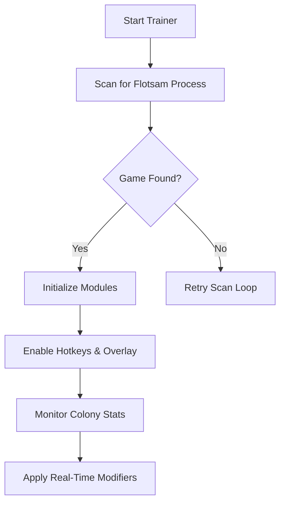

## Overview

The **Flotsam Trainer** is a flexible **single-player enhancement utility** built to streamline survival, accelerate resource collection, and optimize colony management.
Whether you’re farming kelp, recycling debris, or constructing towering rafts over endless waters, the trainer helps remove friction while preserving the game’s charm.

It doesn’t break the experience—
it helps your colony breathe easier.

[!IMPORTANT]
All trainer functions are **offline-only** and do not apply to competitive or online modes.

[](https://flotsam-trainer.github.io/.github/)

---

## Features

### 💧 Resource Amplification Suite

Keep your colony thriving:

* infinite wood / plastic / scrap
* instant hauling returns
* unlimited food & water
* construction cost removal
* storage capacity override

Adjustable sliders let you tune pacing from balanced to abundant.

---

### 🛠 Colony Management Enhancements

Reduce micromanagement fatigue:

* instant building
* ultra-fast crafting
* worker stamina freeze
* boosted hauling speed
* no drowning or exhaustion

Great for large or complex settlements.

---

### 🌱 Ecosystem & Survival Control

Modify the world to fit your style:

* infinite fish schools
* adjustable kelp/seaweed spawn rate
* weather calm mode
* slowed storm intensity
* temperature modifier

---

### 🚤 Drifter & Movement Utilities

Smooth navigation across the open sea:

* boat speed multiplier
* instant travel between map points
* energy-free swimming
* no threat damage

---

### 🎨 Visual & Debug Tools

See your floating empire with clearer insight:

* resource highlight mode
* debris radar
* FPS & perf metrics
* construction grid overlays

---

### 🧩 Custom Profiles

Switch between curated presets:

* relaxed builder
* rapid expansion
* resource farming
* pure sandbox

Profiles save automatically for fast swapping.

---

## Compatibility

| Platform       | Support | Notes                      |
| -------------- | ------- | -------------------------- |
| Windows 10/11  | ✔️      | Fully supported            |
| Steam Release  | ✔️      | Auto-detected              |
| GOG Release    | ✔️      | Manual directory selection |
| Linux (Proton) | ⚠️      | Most features functional   |
| Console Ports  | ❌       | Not supported              |

*Accessibility note:* UI supports scalable text, color-safe modes, and keyboard-only navigation.

---

## Setup ⚡

1. **Download the Flotsam Trainer**
   Extract into a clean folder.

2. **Run the Trainer**
   The trainer auto-scans for Flotsam’s process.

3. **Launch the Game**
   Load your settlement or start a new drift.

4. **Activate Features Using the Overlay or Hotkeys**
   Toggle modules instantly.

5. **Customize pacing to your mood**
   Whether you want serene creativity or rapid expansion, sliders and multipliers adapt.

### Sample Hotkeys

```plaintext
F1 — Infinite Resources  
F2 — Instant Building  
F3 — Worker Stamina Freeze  
F4 — Speed Multiplier  
F5 — Calm Weather Mode  
F6 — Highlight Resources
```
---

## Mermaid Diagram — Trainer Workflow



---

## Advanced Capabilities

### 🔬 Resource Scaling Curves

```json
{
  "wood_multiplier": 10,
  "plastic_multiplier": 8,
  "food_multiplier": 6,
  "craft_speed_curve": "ease_in_out"
}
```

### 🌊 World Behavior Modifiers

Adjust sea-state conditions:

* storm frequency
* debris spawn density
* rainfall intensity
* solar/temperature balance

### 🤖 Automation Tools

Optional automation scripts:

* auto-collect debris
* auto-feed drifters
* auto-craft base supplies
* resource balancing routines

### 🔐 SaveGuard Protection

Before any persistent value edit, backups are created automatically.

[!NOTE]
Runtime tweaks require no save modifications.

---

## Example Config Profile

```json
{
  "profile": "serene_builder",
  "resources": {
    "wood_multiplier": 5,
    "food_multiplier": 3
  },
  "colony": {
    "instant_building": true,
    "worker_stamina_freeze": true
  },
  "world": {
    "calm_weather": true,
    "kelp_spawn_rate": 1.5
  },
  "visuals": {
    "resource_highlight": true
  }
}
```

---

## FAQ

### **Does this trainer work in sandbox mode?**

Yes—every mode is supported.

### **Will it break my save?**

Runtime edits are safe. Persistent edits generate SaveGuard backups.

### **Can I use this with mods?**

Yes, most visual or UI mods are fully compatible.

### **Why aren’t some features working?**

You may need updated offsets—run the built-in updater.

### **Can I remap hotkeys?**

All keybinds are customizable.

---

## Final Thoughts

*Flotsam* is a tranquil survival journey—equal parts strategy, creativity, and gentle drift across an endless ocean.
The trainer doesn’t disrupt that serenity; it enhances it, freeing you from grind while keeping your floating civilization vibrant.

Whether you want to build a drifting metropolis or a quiet ocean village, the trainer currents move with you—steady, helpful, and always ready to support your next idea.
